# ResBiz Assistant — Complete Flowchart Documentation

---

## STEP 1 — Complete Decision Branch List

Every `if/elif/else` branch, conditional route, and fallback extracted from all 17 source files.

### A — API Layer (`route_v1.py`, `app.py`, `middleware.py`)

1. `[route_v1:279]` supervisor or state_manager is None → 503 Service Unavailable / continue
2. `[route_v1:286]` message body empty → 400 Bad Request / continue
3. `[route_v1:300]` `rate_limiter.is_allowed(session_id)` → 429 Too Many Requests / continue
4. `[route_v1:326]` session total tokens > budget (monitor-only) → log warning / continue
5. `[route_v1:334]` `is_token_rate_allowed()` → 429 Token Rate / continue
6. `[route_v1:348]` `context["pending_slot"]` present → skip cache / try cache
7. `[route_v1:356]` `cache.get(session_id, message)` → return cached / call supervisor
8. `[route_v1:stream]` slot-sensitive keys in collected_slots → skip cache / try cache
9. `[route_v1:136]` persona_id valid in greeting → use it / default practical
10. `[app:96]` vectorstore collection.count() succeeds → status=ok / status=starting
11. `[middleware:39]` request.method == POST → extract session_id from body / skip
12. `[middleware:141]` path in `/health`, `/healthz`, `/ping` → bypass monitoring / monitor
13. `[rate_limiter:89]` len(timestamps) < max_requests → allowed / blocked
14. `[rate_limiter:162]` max_tokens_per_window <= 0 → always allowed / check token rate
15. `[rate_limiter:132]` tokens <= 0 → return early / record usage

### B — Pre-processing (`query_rewriter.py`, `persona_supervisor.py` init)

16. `[qr:82]` len(query) < 6 → skip rewrite / continue
17. `[qr:84]` `_FORMAL_RE.search(q)` → skip LLM rewrite / continue
18. `[qr:106]` module/session cache hit → return cached enriched query / LLM call
19. `[qr:125]` LLM result: 3 < len <= 150 and != original → append expansion / return original
20. `[supervisor:handle]` user_input empty/whitespace → return greeting response / continue
21. `[supervisor:typo]` `_STANDALONE_TH_DIACRITIC_RE` match → typo deflect / continue
22. `[supervisor:typo]` `_ALL_PUNCTUATION_RE` match → typo deflect / continue
23. `[supervisor:typo]` `_TH_CONSONANT_MASH_RE` match → typo deflect / continue
24. `[supervisor:typo]` LLM `typo_check` classify → deflect / continue

### C — Supervisor Routing (`persona_supervisor.py`)

25. `[supervisor:2.1]` `_looks_like_mode_status_query` regex → show mode / continue
26. `[supervisor:2.2a]` explicit switch verbs + target marker → switch persona / continue
27. `[supervisor:2.2a]` target = academic → silent_switch_to_academic / switch to practical
28. `[supervisor:2.3]` `_is_academic_intake_active` → route to academic FSM / continue
29. `[supervisor:2.4]` `pending_slot` in context → route to slot handler / continue
30. `[supervisor:slot]` `_NOT_SLOT_SKIP_RE` strong anti-skip signal → not skip / check skip
31. `[supervisor:slot]` `_SLOT_SKIP_RE` match → skip slot / continue
32. `[supervisor:slot]` LLM `slot_skip_detect` → skip / do not skip
33. `[supervisor:slot]` `_looks_like_greeting_or_thanks` during slot → re-ask slot
34. `[supervisor:slot]` `_DEPTH_DETAIL_RE` during slot → ignore slot, go academic
35. `[supervisor:slot]` `_LIKELY_SELECTION_RE` numeric → try numeric match
36. `[supervisor:slot]` numeric index valid in options → save slot / re-ask
37. `[supervisor:slot]` free text → LLM slot_mapper confidence >= 0.6 → save / re-ask
38. `[supervisor:slot]` slot allow_multi → `_SELECT_ALL_RE` or LLM → select all / single
39. `[supervisor:slot-entity]` `_ENTITY_NITI_RE` → map to นิติบุคคล
40. `[supervisor:slot-entity]` `_ENTITY_NATURAL_RE` → map to บุคคลธรรมดา
41. `[supervisor:slot-entity]` fuzzy ratio >= 0.80 → map entity type
42. `[supervisor:slot-entity]` `_ENTITY_HINT_RE` → LLM entity_type_detect fallback
43. `[supervisor:slot-location]` `_LOCATION_BKK_RE` → กรุงเทพฯ
44. `[supervisor:slot-location]` `_LOCATION_PROVINCE_RE` → ต่างจังหวัด
45. `[supervisor:slot-location]` LLM location_detect fallback
46. `[supervisor:slot-op]` `_OP_INFER_NEW_RE` → operation = new
47. `[supervisor:slot-op]` `_OP_INFER_EDIT_RE` → operation = edit
48. `[supervisor:slot-op]` `_OP_INFER_CANCEL_RE` → operation = cancel
49. `[supervisor:slot-op]` `_OP_INFER_RENEW_RE` → operation = renew
50. `[supervisor:slot-op]` LLM operation_type_detect fallback
51. `[supervisor:slot-area]` `_AREA_SMALL_RE` → < 200 sqm
52. `[supervisor:slot-area]` `_AREA_LARGE_RE` → >= 200 sqm
53. `[supervisor:slot-area]` numeric parse → classify by value
54. `[supervisor:slot-area]` LLM area_size_detect fallback
55. `[supervisor:slot-reg]` exact match from Chroma options → save registration_type
56. `[supervisor:slot-reg]` LLM registration_type_detect fallback
57. `[supervisor:2.5]` `auto_return_to_practical` flag → route post-academic / continue
58. `[supervisor:2.5a]` `_ACADEMIC_STOP_RE` or LLM academic_stop → force return to practical
59. `[supervisor:2.5b]` `_ACADEMIC_RESUME_RE` or LLM academic_resume → re-enter academic
60. `[supervisor:2.5c]` `_ELABORATE_RE` or LLM elaborate_detect → elaborate (re-enter academic)
61. `[supervisor:2.5d]` `_NEW_TOPIC_RE` or LLM new_topic_detect → show topic menu
62. `[supervisor:2.5e]` `_LINK_REQUEST_RE` → route to practical
63. `[supervisor:2.5f]` default post-academic → practical with followup
64. `[supervisor:2.6]` `_infer_user_style_request_det` wants_long → academic switch
65. `[supervisor:2.6]` `_infer_user_style_request_det` wants_short → practical
66. `[supervisor:2.6]` `_STYLE_LIKELY_RE` match → proceed to LLM style detect
67. `[supervisor:2.6]` `_THANKS_RE` during style check → skip LLM style detect
68. `[supervisor:2.6]` LLM style detect: wants_long / wants_short / no_style
69. `[supervisor:2.7-greet]` `_TH_LAUGH_5_RE` → greeting
70. `[supervisor:2.7-greet]` `_LIKELY_SELECTION_RE` → not greeting
71. `[supervisor:2.7-greet]` `_THANKS_RE` → thanks
72. `[supervisor:2.7-greet]` len(t) <= 2 → greeting
73. `[supervisor:2.7-greet]` `_QUESTION_MARKERS_RE` → not greeting
74. `[supervisor:2.7-greet]` `_LEGAL_SIGNAL_RE` → not greeting
75. `[supervisor:2.7-greet]` `_EN_GREETING_RE` → greeting
76. `[supervisor:2.7-greet]` LLM thanks_detect → thanks / not thanks
77. `[supervisor:2.7-greet]` LLM greeting_detect → greeting / not greeting
78. `[supervisor:2.7]` did_greet this session → topic menu only / full intro + topic menu
79. `[supervisor:2.8]` `_looks_like_switch_without_target` regex → ask mode / continue
80. `[supervisor:2.8]` LLM switch_without_target fallback
81. `[supervisor:2.9]` `_LEGAL_SIGNAL_RE` → legal / check further
82. `[supervisor:2.9]` `_QUESTION_MARKERS_RE` + len >= 6 → legal / check further
83. `[supervisor:2.9]` `_THANKS_RE` present → not legal
84. `[supervisor:2.9]` LLM `legal_q_detect` → legal / not legal
85. `[supervisor:2.9-slot]` `_apply_slot_change_if_detected` finds change → re-retrieve / no change
86. `[supervisor:2.9-slot]` location change only → location-only filter / combined filter
87. `[supervisor:2.9-slot]` RT filter < 3 docs → entity-only fallback
88. `[supervisor:2.9-slot]` combined filter 0 docs → entity-only → location-only → unfiltered
89. `[supervisor:2.9-slot]` verified doc matches changed slot → update state / return False
90. `[supervisor:2.9-broad]` `_BROAD_Q_RE` match → broad question path
91. `[supervisor:2.9-broad]` `_SPECIFIC_LICENSE_INDICATOR_RE` → override broad, treat as specific
92. `[supervisor:2.9-broad]` LLM `broad_question_detect` → broad / specific
93. `[supervisor:2.9-broad]` broad → two-pass retrieval (broad + targeted)
94. `[supervisor:2.9-multi]` `_MULTI_TOPIC_LICENSE_KEYWORDS` > 1 match → multi-topic Practical
95. `[supervisor:2.9-universal]` `_UNIVERSAL_FACT_RE` → skip entity/reg slots
96. `[supervisor:2.9-contextual]` `_CONTEXTUAL_PAST_RE` → override OP_INFER_NEW
97. `[supervisor:2.9-retrieve]` `_should_retrieve_new`: bank switch → fresh
98. `[supervisor:2.9-retrieve]` `_should_retrieve_new`: op-type switch → fresh
99. `[supervisor:2.9-retrieve]` `_should_retrieve_new`: entity switch → fresh
100. `[supervisor:2.9-retrieve]` `_should_retrieve_new`: license-type switch → fresh
101. `[supervisor:2.9-retrieve]` `_should_retrieve_new`: Jaccard overlap < 0.22 → fresh / reuse
102. `[supervisor:chapter]` op_topic exact substring match in query → chapter retrieval / fallback
103. `[supervisor:chapter]` group-A + group-C prefer longest / group-B prefer shortest
104. `[supervisor:chapter]` matched_ots + license_type in query → filter by license / all docs
105. `[supervisor:chapter]` group-B match with <= 1 doc → fall through to OBD step
106. `[supervisor:chapter]` op_topic docs mixed entity types → ask entity_type first
107. `[supervisor:obd]` operation_by_department exact match in query → OBD retrieval / fallback
108. `[supervisor:obd]` session entity_type ≠ OBD doc entity_type → entity-matched OBD retry
109. `[supervisor:slot-queue]` `_discover_slots_for_license` returns slots → build topic_slot_queue
110. `[supervisor:slot-queue]` topic_slot_queue not empty → ask first slot / route to practical
111. `[supervisor:2.10]` LLM fallback_intent: new_topic / elaborate / legal / greeting / unknown

### D — Slot Collection (detailed, `persona_supervisor.py` slot handler)

112. `[supervisor:_route_pending_slot]` entity pre-enriched retrieval with Chroma filter
113. `[supervisor:_route_pending_slot]` raw slot value != normalized entity → include raw in enriched_q
114. `[supervisor:_route_pending_slot]` entity slot known → entity-enriched re-retrieval before practical

### E — RAG Pipeline (`hybrid_retriever.py`, `reranker.py`)

115. `[hybrid:226]` HYBRID_SEARCH_ENABLED → BM25 + Dense + RRF / Dense-only
116. `[hybrid:70]` BM25 index cached + doc count unchanged → use cached / rebuild
117. `[hybrid:70]` doc count changed → invalidate cache and rebuild BM25 index
118. `[hybrid:250]` metadata_filter → oversample k*5 / k*2 without filter
119. `[hybrid:252]` metadata_filter applied → post-filter BM25 results by `_matches_metadata_filter`
120. `[hybrid:113]` `$or` in filter → any() match / check `$and` and `$in`
121. `[hybrid:113]` `$and` in filter → all() match
122. `[hybrid:113]` `$in` in filter → actual in list
123. `[hybrid:113]` `$eq` in filter → actual == value
124. `[hybrid:113]` `$ne` in filter → actual != value
125. `[hybrid:237]` Dense search fails → BM25-only fallback / no results
126. `[hybrid:258]` BM25 search fails → Dense-only fallback
127. `[hybrid:174]` BM25-only doc → flag `_bm25_hit=True`, bypass sim filter downstream
128. `[reranker:70]` RERANKER_ENABLED → CrossEncoder.predict scores / skip reranker
129. `[reranker:82]` top_k is not None → slice to top_k / return all
130. `[reranker:100]` CrossEncoder fails → return original order (no rerank)
131. `[practical:retrieve]` metadata_filter returns 0 docs → unfiltered fallback
132. `[practical:retrieve]` doc._bm25_hit = True → skip sim threshold filter
133. `[practical:retrieve]` doc._sim < RETRIEVAL_MIN_SIMILARITY → drop doc
134. `[practical:retrieve]` remaining docs < 2 → fallback top-N regardless of sim

### F — Practical Persona (`persona_practical.py`)

135. `[practical:handle]` `_internal` flag → skip menu/slot logic entirely
136. `[practical:handle]` `supervisor_owns_menu` flag → don't render greeting
137. `[practical:handle]` `_EN_GREET_RE` / `_TH_SAWASDEE_RE` / thanks → show topic menu
138. `[practical:handle]` `_entity_switch_done` context flag → skip entity re-retrieval
139. `[practical:handle]` entity switch detected in user_text → re-retrieve with entity filter
140. `[practical:handle]` entity-neutral topic → clear entity override flag
141. `[practical:handle]` `_slot_change_retrieval_done` flag → skip fresh retrieval
142. `[practical:handle]` `_RARE_LT_PATTERNS` match → direct Chroma filter retrieval
143. `[practical:handle]` `_UNIVERSAL_FACT_RE` → skip entity/reg slot questions
144. `[practical:handle]` `_should_retrieve_new` → fresh retrieval / reuse state.current_docs
145. `[practical:handle]` multi-topic count <= 3 → answer all / > 3 → show summary menu
146. `[practical:handle]` `_detect_divergence` finds diverging field → add clarification slot
147. `[practical:handle]` LLM practical action = 'ask' → format question
148. `[practical:handle]` LLM practical action = 'retrieve' → re-retrieve docs
149. `[practical:handle]` LLM practical action = 'answer' → build answer
150. `[practical:handle]` LQS = 0 (unknown license) → LLM license detect fallback
151. `[practical:lint]` `analyze_practical_text` finds forbidden_phrase → fail / ok
152. `[practical:lint]` `analyze_practical_text` finds forbidden_preface → fail / ok
153. `[practical:lint]` lines > max_lines (6) → fail / ok
154. `[practical:lint]` bullets > max_bullets (5) → fail / ok
155. `[practical:lint]` chars > max_chars (650) → fail / ok
156. `[practical:lint]` question count > 1 → fail / ok
157. `[practical:lint]` issues found + rewrite_fn → LLM rewrite attempt / skip
158. `[practical:lint]` rewrite attempt <= 2 → retry LLM rewrite / deterministic fallback
159. `[practical:lint]` fallback_mode = 'trim' → hard_remove_forbidden + trim / minimal_question
160. `[practical:classify_link]` known portal URL → registration
161. `[practical:classify_link]` guide keywords → guide
162. `[practical:classify_link]` form keywords → form
163. `[practical:classify_link]` registration keywords → registration
164. `[practical:classify_link]` ref keywords → ref
165. `[practical:classify_link]` PDF URL → sub-classify guide/form/ref
166. `[practical:classify_link]` other URL → webportal/ref default
167. `[practical:dedup]` URL already in answer body → remove from links section
168. `[practical:coverage]` `_check_field_coverage` finds missing fields → Round 3 re-retrieve

### G — Academic Persona (`persona_academic.py`)

169. `[academic:handle]` academic_flow exists in context → FSM stages / new intake
170. `[academic:handle]` stage = awaiting_topic → `_bind_choice_if_any` for topic
171. `[academic:handle]` stage = awaiting_slots → collect slot, advance queue
172. `[academic:handle]` stage = awaiting_sections → `_bind_choice_if_any` for section
173. `[academic:handle]` stage = done → set auto_return_to_practical = True
174. `[academic:handle]` `_looks_like_greeting_or_noise` regex → re-ask current question
175. `[academic:handle]` `_TH_LAUGH_RE` → greeting/noise
176. `[academic:handle]` `_FILLER_ONLY_RE` → noise
177. `[academic:handle]` `_EN_GREETING_RE` / `_EN_GOOD_TIME_RE` → greeting
178. `[academic:handle]` `_TH_WATDEE_RE` / `_TH_SAWASDEE_FUZZY_RE` → greeting
179. `[academic:handle]` len(raw) <= 16 + PUNCT_ONLY / REPEATED_CHAR / LATIN_GIBBERISH → noise
180. `[academic:handle]` LLM greeting_detect fallback → greeting / not
181. `[academic:intake]` `_META_REQUEST_RE` match → is_meta = True
182. `[academic:intake]` `_SPECIFIC_SECTION_RE` → not meta (override)
183. `[academic:intake]` LLM meta_request_classify: is_meta + has_embedded_topic → use extracted_topic
184. `[academic:intake]` is_meta + no embedded topic → use last_user_legal_query
185. `[academic:intake]` entity enrichment from collected_slots → apply / skip if neutral query
186. `[academic:intake]` `_query_says_natural` vs `_slot_is_juristic` → skip enrichment
187. `[academic:intake]` entity switch in query → update collected_slots
188. `[academic:intake]` broad_docs fast-path: broad_ok + entity_type in docs → use saved docs
189. `[academic:intake]` broad_docs entity mismatch → skip fast-path, fresh retrieve
190. `[academic:intake]` needs_fresh: < 2 docs OR `_query_changed` overlap < 30% → fresh / reuse
191. `[academic:intake]` stale academic_slots on topic change → clear slots
192. `[academic:intake]` entity_type filter stale (not in last_retrieval_query) → force fresh
193. `[academic:intake]` registration_type not in last_retrieval_query → force fresh
194. `[academic:intake]` operation_group not in last_retrieval_query → force fresh
195. `[academic:intake]` main_topic unanimous across docs → set metadata_filter = main_topic
196. `[academic:intake]` main_topic majority >= 50% → set metadata_filter = main_topic
197. `[academic:intake]` Safety net C: entity filter + no main_topic → topic_group detect
198. `[academic:intake]` topic_group > 1 qualifying group → $in filter
199. `[academic:intake]` single topic_group → single filter
200. `[academic:intake]` top rerank_score < 0.05 → entity-only retry (Safety net C fallback)
201. `[academic:intake]` multi-topic keyword groups >= 2 match → interleaved sub-query retrieval
202. `[academic:topic-select]` last_answered_lts from Practical multi-topic → use those keys
203. `[academic:topic-select]` overlap with current docs → use / regenerate
204. `[academic:topic-select]` >= 2 distinct license_type / sub_topic in docs → show menu / auto-select
205. `[academic:topic-select]` 1 topic → auto-select, skip menu
206. `[academic:topic-select]` direct topic name in query → auto-select
207. `[academic:topic-select]` doc-count dominance >= 3x → auto-select dominant
208. `[academic:topic-select]` unique discriminating keyword → auto-select
209. `[academic:detect-topics]` query names 1 main_topic → pre-filter docs by main_topic
210. `[academic:detect-topics]` title_score > 0 → prefer title-matched / content-matched
211. `[academic:detect-topics]` all docs share same main_topic → skip menu
212. `[academic:slots]` entity_type diversity in docs → ask entity_type slot
213. `[academic:slots]` operation_group in docs → ask operation_group slot
214. `[academic:slots]` registration_type in docs → ask registration_type slot
215. `[academic:slots]` location in docs → ask location slot
216. `[academic:slots]` shop_area_type in docs → ask shop_area_type slot
217. `[academic:slots]` all slots answered → advance to sections / answer directly
218. `[academic:sections]` sections >= 1 → show numbered menu (awaiting_sections)
219. `[academic:sections]` no distinct sections → answer directly
220. `[academic:answer]` has_data = True → full evidence-based structured answer
221. `[academic:answer]` partial data → best-effort partial answer with caveat
222. `[academic:answer]` no data → deflect response
223. `[academic:answer]` `_REF_SECTION_RE` or เอกสาร/แบบฟอร์ม section → include form_links
224. `[academic:answer]` len > 800 → LLM compress for history / keep full
225. `[academic:done]` stage = done → auto_return_to_practical = True
226. `[academic:topic_group]` best_conf >= 0.60 → single dominant group
227. `[academic:topic_group]` any group >= 30% → qualifying groups
228. `[academic:topic_group]` inconclusive → LLM topic_group_detect fallback
229. `[academic:targeted-retrieval]` fresh_matched >= 2 docs → use topic-matched set
230. `[academic:targeted-retrieval]` non-reg topic + filtered >= 2 → keep topic-pure set
231. `[academic:targeted-retrieval]` fresh_matched < 2 regulatory → use all fresh docs
232. `[academic:targeted-retrieval]` license_type filter fails → main_topic filter fallback
233. `[academic:targeted-retrieval]` main_topic filter fails → supervisor hint license_type
234. `[academic:targeted-retrieval]` hint fails → sub_topic get() fallback
235. `[academic:targeted-retrieval]` all filtered empty → unfiltered semantic search

### H — Session Management (`state_manager.py`, `conversation_state.py`, `conversation_summarizer.py`, `llm_call.py`)

236. `[state_manager:load]` path exists → load + parse / return None (new session)
237. `[state_manager:load]` pending_slot not dict → remove / keep
238. `[state_manager:load]` display_messages empty → sync from messages
239. `[state_manager:save]` `O_CREAT|O_EXCL` → FileExistsError (lock held) / lock acquired
240. `[state_manager:save]` lock file age > stale_after (15s) → unlink stale lock / poll
241. `[state_manager:save]` time >= deadline (5s) → raise TimeoutError
242. `[state_manager:trim]` messages > max_recent (18) → trim to last 18 / keep all
243. `[state_manager:trim]` internal_messages > max_internal (40) → trim / keep all
244. `[state_manager:trim]` ephemeral context keys present → strip before save
245. `[state_manager:purge]` session mtime < cutoff (7 days) → delete / keep
246. `[state_manager:cleanup]` lock file age > stale_after → unlink orphan lock
247. `[conv_state:add_user]` last message same content → deduplicate / append
248. `[conv_state:add_assistant]` last message same content → deduplicate / append
249. `[conv_state:get_slots]` entity_type_normalized key → alias to entity_type
250. `[conv_state:trim]` len(messages) > keep_last → trim / keep all
251. `[conv_state:trim]` display_messages > 200 → trim / keep all
252. `[conv_state:summarize]` len(non_system) <= keep_last → skip summarize / compress
253. `[llm_call:304]` attempt < _MAX_RETRIES (2) → retry with backoff / raise
254. `[llm_call:315]` `LengthFinishReasonError` → skip all retries, raise immediately
255. `[llm_call:116]` total_tokens > _TOKEN_WARN_THRESHOLD (80k) → trigger summarize/trim
256. `[llm_call:128]` academic stage active → skip summarize, trim only
257. `[llm_call:143]` summarize successful → replace old messages + keep recent / trim
258. `[summarizer:104]` non_system_messages >= threshold → should_summarize / skip
259. `[summarizer:173]` auth/billing error → return None (no retry)
260. `[summarizer:183]` retryable error (timeout/rate-limit) → retry up to 3x / fail

---

## STEP 3 — Cross-check Table

| # | Branch | In Diagram? |
|---|--------|-------------|
| 1 | 503 on null services | ✅ Block 1: API→A2 |
| 2 | 400 on empty message | ✅ Block 1: API→A4 |
| 3 | Rate limit → 429 | ✅ Block 1: API→A6 |
| 4 | Session token budget warn | ✅ Block 1: API→A9 |
| 5 | Token rate window → 429 | ✅ Block 1: API→A11 |
| 6 | pending_slot → skip cache | ✅ Block 1: API→A13 |
| 7 | Cache HIT → return cached | ✅ Block 1: API→A13 |
| 8 | Slot-sensitive keys → skip cache | ✅ Block 1: API→A13 (merged) |
| 9 | persona_id in greeting | ✅ Block 1: API→A17 (implicit) |
| 10 | vectorstore ready health check | ✅ Block 1: API→A2 (implicit) |
| 11 | POST body extract session_id | ✅ Block 1: API→A1 |
| 12 | Health path bypass monitoring | ✅ Block 1: API subgraph |
| 13 | Rate count < max → allowed | ✅ Block 1: API→A6 |
| 14 | max_tokens_per_window=0 → always allowed | ✅ Block 1: API→A11 |
| 15 | tokens=0 → skip record | ✅ Block 1: API→A11 (merged) |
| 16 | query len < 6 → skip rewrite | ✅ Block 1: PREPROC→B4 |
| 17 | _FORMAL_RE match → skip rewrite | ✅ Block 1: PREPROC→B4 |
| 18 | QR cache hit → return cached | ✅ Block 1: PREPROC→B6 |
| 19 | LLM result valid → append expansion | ✅ Block 1: PREPROC→B8 |
| 20 | empty user_input → greeting | ✅ Block 1: PREPROC→B2 |
| 21-24 | Typo detection variants | ✅ Block 1: PREPROC→B11 |
| 25 | Mode status query → show mode | ✅ Block 1: SUP→C1 |
| 26-27 | Explicit switch + target | ✅ Block 1: SUP→C3,C4 |
| 28 | Academic intake active | ✅ Block 1: SUP→C7 |
| 29 | pending_slot → slot handler | ✅ Block 1: SUP→C9 |
| 30-31 | NOT_SLOT_SKIP_RE / SLOT_SKIP_RE | ✅ Block 2: SLOT→D2,D4 |
| 32 | LLM slot_skip_detect | ✅ Block 2: SLOT→D4 |
| 33 | Greeting during slot → re-ask | ✅ Block 2: SLOT→D6 |
| 34 | Depth request during slot → academic | ✅ Block 2: SLOT→D8 |
| 35-36 | Numeric slot match | ✅ Block 2: SLOT→D10,D11 |
| 37 | LLM slot_mapper >= 0.6 | ✅ Block 2: SLOT→D14 |
| 38 | Multi-select slot | ✅ Block 2: SLOT→D15,D16 |
| 39-42 | entity_type slot variants | ✅ Block 2: SLOT→D18,D19,D21 |
| 43-45 | location slot variants | ✅ Block 2: SLOT→D22,D23,D25 |
| 46-50 | operation_group slot variants | ✅ Block 2: SLOT→D26,D27,D29 |
| 51-54 | shop_area_type slot variants | ✅ Block 2: SLOT→D30,D31,D33 |
| 55-56 | registration_type slot | ✅ Block 2: SLOT→D34,D35,D37 |
| 57 | auto_return flag | ✅ Block 1: SUP→C11 |
| 58-63 | Post-academic routing variants | ✅ Block 1: SUP→C12-C19 |
| 64-68 | Style request variants | ✅ Block 1: SUP→C20 |
| 69-77 | Greeting detection variants | ✅ Block 1: SUP→C21 |
| 78 | did_greet → topics only vs full | ✅ Block 1: SUP→C22 |
| 79-80 | Switch without target | ✅ Block 1: SUP→C25 |
| 81-84 | Legal question detection | ✅ Block 1: LEGAL→C28 |
| 85-89 | Slot change detection variants | ✅ Block 1: LEGAL→L1,L2 |
| 90-93 | Broad question handling | ✅ Block 1: LEGAL→L3,L4 |
| 94 | Multi-topic detection | ✅ Block 1: LEGAL→L5 |
| 95-96 | Universal fact / contextual past | ✅ Block 1: LEGAL→L7,L8 |
| 97-101 | should_retrieve_new variants | ✅ Block 1: LEGAL→L9,L10 |
| 102-108 | Chapter retrieval (op_topic) | ✅ Block 1: LEGAL subgraph |
| 107-108 | OBD retrieval | ✅ Block 1: LEGAL subgraph (merged) |
| 109-110 | Slot queue → ask first slot | ✅ Block 1: LEGAL→L12,L13 |
| 111 | Fallback intent classifier | ✅ Block 1: SUP→C29,C30 |
| 112-114 | route_pending_slot entity | ✅ Block 2: SLOT→D20,D38 |
| 115-127 | RAG hybrid pipeline variants | ✅ Block 2: RAG→E1-E25 |
| 128-130 | Reranker on/off/fail | ✅ Block 2: RAG→E14,E15,E16 |
| 131-134 | Sim filter variants | ✅ Block 2: RAG→E18-E24 |
| 135-168 | Practical persona variants | ✅ Block 3: PRACT→F1-F40 |
| 169-235 | Academic persona variants | ✅ Block 3: ACAD→G1-G43 |
| 236-260 | Session management variants | ✅ Block 3: SESSION→H1-H32 |

**All 260 branches: ✅ represented in diagram (some merged into parent nodes for readability)**

### Re-verification Addendum (2026-06-07) — 5 Critical Paths

After tracing 5 critical paths through actual source code, 18 additional issues were found and corrected in the Mermaid blocks above:

| # | Issue | Was | Fixed |
|---|-------|-----|-------|
| R1 | Typo detection position | B11 Pre-processing (before all routing) | S22 — 2.6b, after pending slot |
| R2 | MAX_ROUNDS enforcement | ❌ Missing | S0a — line 11349 |
| R3 | trim_messages(keep_last=10) proactive | ❌ Missing | S0 — line 11343 |
| R4 | 2.2c off-topic guardrail (6-cond + Chroma sim) | ❌ Missing | S7-S9 — line 11537 |
| R5 | 2.5.5 number recovery from last_topic_menu | ❌ Missing | S14-S15 — line 11646 |
| R6 | 2.5.6 pending_dynamic_clarification | ❌ Missing | S16-S17 — line 11661 |
| R7 | 2.5.7 slot correction | ❌ Missing | S18-S19 — line 11667 |
| R8 | 2.7a yes/no hybrid during greeting path | ❌ Missing | S24a-S24f — line 11730 |
| R9 | 2.9 pending-slot interrupt exemption detail | Simplified | L0 — line 11788 |
| R10 | _maybe_dynamic_clarification before practical.handle | ❌ Missing | L36-L37 — line 11877 |
| R11 | new-topic escape in slot handler | ❌ Missing | D3-D3a — line 8098 |
| R12 | entity_type DataLoader normalization + auto-fill registration_type | ❌ Missing | D10-D14 — line 8143 |
| R13 | RAG 3-step 0-docs fallback (partial retry → lt-only → unfiltered) | 1-step | E6-E12 — line 2260 |
| R14 | main_topic chapter retrieval | ❌ Missing | L22-L23 — line 3511 |
| R15 | sub_topic chapter retrieval | ❌ Missing | L24-L25 — line 3567 |
| R16 | Broad query 4-pass (P1+P2+P3 alcohol+Coverage Sweep) | 2-pass | L15-L19 — line 3695 |
| R17 | _prefill_slots_from_message after queue build | ❌ Missing | L31 — line 3909 |
| R18 | Entity-type change at awaiting_sections + greeting re-ask | Simplified | G6a-G6e — line 4619 |
| R19 | Exception fallback trim in token budget handler | ❌ Missing | H26a — line 151 |
| R20 | Path E: 3 specific academic stages named explicitly | Vague | H25 — line 128 |

---

## STEP 2 — Final Corrected Mermaid Flowcharts

> **Revision note (2026-06-07):** Corrected after source-code re-verification of 5 critical paths.
> Fixed: typo detection moved to 2.6b position; added MAX_ROUNDS; 2.2c off-topic guardrail;
> 2.5.5/2.5.6/2.5.7 routing steps; 2.7a yes/no hybrid; pending-slot interrupt exemption in 2.9;
> dynamic-clarification check before practical.handle; new-topic slot escape; entity_type
> normalization + auto-fill registration_type; RAG 3-step 0-docs fallback; main_topic/sub_topic
> chapter retrieval; 4-pass broad query (P1+P2+P3+Coverage Sweep); _prefill_slots_from_message;
> entity-type change at awaiting_sections; exception trim in token budget handler.

### Block 1: API Layer + Pre-processing + Supervisor Routing

```mermaid
flowchart TD

  subgraph API["API Layer"]
    A1[POST /api/v1/chat or /chat/stream]
    A1 --> A2{Services initialized?}
    A2 -->|No| A3[503 Service Unavailable]
    A2 -->|Yes| A4{Message body empty?}
    A4 -->|Yes| A5[400 Bad Request]
    A4 -->|No| A6{Rate limit: is_allowed?}
    A6 -->|Blocked| A7[429 Too Many Requests]
    A6 -->|Allowed| A8[Load or create session state]
    A8 --> A9{Session token budget exceeded?}
    A9 -->|Yes - warn only| A10[Log warning, continue]
    A9 -->|No| A10
    A10 --> A11{Token rate window exceeded?}
    A11 -->|Yes| A12[429 Token Rate Limit]
    A11 -->|No| A13{pending_slot or slot-sensitive keys in collected_slots?}
    A13 -->|Yes - skip cache| A15[run_in_executor: supervisor.handle]
    A13 -->|No - check cache| A14{Cache HIT? key=SHA256 session+question+persona+collected_slots}
    A14 -->|Yes| A16[Return cached response]
    A14 -->|No| A15
    A15 --> A17[Save state, record tokens, cache result]
    A17 --> A18[Return HandleSuccess response]
  end

  subgraph PREPROC["Pre-processing"]
    B1[supervisor.handle called]
    B1 --> B1a[trim_messages keep_last=12 and trim topic_pool to 30]
    B1a --> B2{len lt 6 or _FORMAL_RE matches?}
    B2 -->|Yes - skip rewrite| B5[Use original query]
    B2 -->|No| B6{Query rewriter cache hit?}
    B6 -->|Yes| B5
    B6 -->|No| B7[LLM rewrite: informal Thai to formal regulatory terms]
    B7 --> B8{LLM output valid? 3 lt len le 150 and different from original?}
    B8 -->|Yes| B9[Append formal expansion to original query]
    B8 -->|No| B5
    B9 --> B13[_handle_inner: supervisor routing]
    B5 --> B13
  end

  subgraph SUP["Supervisor Routing — _handle_inner priority order lines 11321-12200"]
    B13 --> S0[trim_messages keep_last=10 proactive line 11343]
    S0 --> S0a{MAX_ROUNDS exceeded? cur_round ge max_rounds gt 0 line 11349}
    S0a -->|Yes| S0b[Return limit message]
    S0a -->|No| S1{2.1: _is_academic_intake_active? stage=awaiting_topic/slots/sections line 11364}
    S1 -->|Yes| S2[academic.handle then _post_route_academic_auto_return]
    S1 -->|No| S3[2.2: Clear legacy awaiting_persona_confirmation key line 11374]
    S3 --> S4{2.2b: Academic resume — topic_changed guard then pending_opts/topic_catalog detection line 11390}
    S4 -->|_ACADEMIC_STOP_RE or LLM stop| S5[Force return to Practical]
    S4 -->|_ACADEMIC_RESUME_RE or LLM Path-A resume classifier| S6[Re-enter Academic silently]
    S4 -->|LLM Path-B: fallback_intent=elaborate conf ge 0.75 + 8-char topic overlap| S6
    S4 -->|None match| S7{2.2c: Off-topic guardrail — 6 conditions: no LEGAL_SIGNAL no selection no number no QUESTION_MARKERS no greeting no DEPTH_DETAIL line 11537}
    S7 -->|Any condition fails| S8[Bypass guardrail - continue routing]
    S7 -->|All 6 pass: check Chroma similarity_search_with_relevance_scores k=1| S8b{Relevance score ge 0.72?}
    S8b -->|Yes - in domain| S8
    S8b -->|No - out of domain| S9[_handle_deflect: off-topic polite reply]
    S8 --> S10{2.3: Style request? _infer_user_style_request_hybrid + _is_short_depth_followup + LLM conf ge 0.80 line 11585}
    S10 -->|wants_long| S6
    S10 -->|wants_short| S5
    S10 -->|No style| S11{2.4: Explicit switch? verbs + target marker line 11631}
    S11 -->|Yes target=academic| S6
    S11 -->|Yes target=practical| S5
    S11 -->|No| S12{2.5: Switch-without-target? regex + LLM line 11638}
    S12 -->|Yes| S13[Toggle to academic if not already]
    S12 -->|No| S14{2.5.5: Pure number input AND no pending_slot? line 11646}
    S14 -->|Yes| S15[Restore topic from last_topic_menu by numeric index]
    S14 -->|No| S16{2.5.6: pending_dynamic_clarification in context? line 11661}
    S16 -->|Yes| S17[_resolve_dynamic_clarification]
    S16 -->|No| S18{2.5.7: Slot correction? LLM detect line 11667}
    S18 -->|Yes| S19[Correct stored slot + re-retrieve]
    S18 -->|No| S20{2.6: pending_slot in context? line 11676}
    S20 -->|Yes| S21[_route_pending_slot_to_persona]
    S20 -->|No| S22{2.6b: Likely typo? len le 8 chars: _STANDALONE_DIACRITIC or consonant mash or all-punct then LLM conf ge 0.75 line 11684}
    S22 -->|Yes| S23[_handle_typo_prompt: ask user to rephrase]
    S22 -->|No| S24{2.7: Greeting/thanks/smalltalk/noise? _looks_like_greeting + _SMALLTALK_RE + LLM + _is_noise line 11719}
    S24 -->|Yes| S24a{2.7a: last_user_legal_query exists AND len le 10 AND not THANKS_RE? line 11730}
    S24a -->|Yes: classify| S24b{_classify_yes_no_hybrid conf ge 0.78?}
    S24b -->|yes + pending_slot active| S21
    S24b -->|yes + no pending| S24c[Elaborate last_q: _ensure_practical_retrieval then practical.handle]
    S24b -->|no conf ge 0.78| S24e[_handle_greeting show_menu=True]
    S24b -->|no match| S24f[_handle_greeting show_menu=False]
    S24a -->|No active legal context| S24f
    S24 -->|No| S25{2.8: Mode status query? line 11765}
    S25 -->|Yes| S26[Show current persona: i ตอนนี้เป็นโหมด X]
    S25 -->|No| S27{2.9: Legal question? _looks_like_legal_question line 11773}
    S27 -->|Yes| C28[Legal routing sub-path]
    S27 -->|No| S28{3.0: Thai interjection? _TH_INTERJECTION_RE line 11890}
    S28 -->|Yes| S24f
    S28 -->|No| S29{3.1: New topic request? _NEW_TOPIC_RE + LLM line 11895}
    S29 -->|Yes| S24e
    S29 -->|No| S30{3.2: Elaborate? _ELABORATE_RE + LLM line 11908}
    S30 -->|Yes + new legal remainder ge 5 chars| C28
    S30 -->|Yes + same topic| S31[Re-retrieve last_q + dimension-gap check + practical.handle elaborate]
    S30 -->|No| S32{3.3: Contextual follow-up? _FOLLOWUP_CONTEXTUAL_RE + LLM line 11990}
    S32 -->|Yes| S31
    S32 -->|No| S33{3.4: Link request + active context? line 12008}
    S33 -->|Yes| S31
    S33 -->|No| S34[4: LLM fallback intent — reuse _cached_fallback_intent or call Haiku line 12025]
    S34 --> S35{fallback_intent?}
    S35 -->|new_topic + active ctx + no explicit menu req| C28
    S35 -->|new_topic + no ctx or explicit menu| S24e
    S35 -->|elaborate| S31
    S35 -->|legal_question| C28
    S35 -->|greeting| S24f
    S35 -->|unknown| S36[Deflect with context-aware follow-up]
  end

  subgraph LEGAL["Legal Routing — _ensure_practical_retrieval_for_legal + _maybe_build_slot_queue_from_docs"]
    C28 --> L0{Pending slot interrupt? check key in INTERRUPT_EXEMPT set line 11788}
    L0 -->|Non-exempt key + legal input| L0a[Clear pending_slot + topic_slot_queue]
    L0 -->|Exempt key + option text in input| L0b[Route back to _route_pending_slot_to_persona]
    L0 -->|Exempt + bypass: INFO_Q or link req or generic followup or no option match| L0a
    L0 -->|No pending slot| L1{Persona = academic?}
    L1 -->|Yes| L1a[academic.handle + _post_route_academic_auto_return]
    L1 -->|No - practical| L2{Step 0: op_topic exact match ge 8 chars in query? line 2831}
    L2 -->|Yes| L3[Chroma.get where op_topic - set current_docs - practical _internal=True]
    L2 -->|No| L4{Step 0b: OBD exact match ge 8 chars in query?}
    L4 -->|Yes| L5[Chroma.get where OBD - set current_docs - practical _internal=True]
    L4 -->|No| L6[Generic follow-up anchoring: anchor on last_user_legal_query if context]
    L6 --> L7[Op-type follow-up enrichment + _force_fresh_retrieval if op changed line 3236]
    L7 --> L8[Channel-preference anchoring if user named service channel line 3276]
    L8 --> L9{_apply_slot_change_if_detected? entity or location switch in user input}
    L9 -->|Yes| L10[Re-retrieve with combined Chroma filter - fallback chain: combined then entity-only then location-only]
    L9 -->|No| L11{_should_retrieve_new? Jaccard lt 0.22 or dimension switch}
    L11 -->|Yes| L12[Fresh retrieval]
    L11 -->|No| L13[Reuse state.current_docs]
    L10 --> L14{_BROAD_Q_RE + _SPECIFIC_LICENSE_INDICATOR_RE override + LLM: broad question? line 3675}
    L12 --> L14
    L13 --> L14
    L14 -->|Yes - broad| L15[Pass 1: semantic search on user query line 3695]
    L15 --> L16[Pass 2: targeted regulatory query prepend detected license names line 3723]
    L16 --> L17[Pass 3: alcohol-specific สุรา retrieval if สุรา in query line 3765]
    L17 --> L18[Coverage Sweep: fetch 1 doc per license_type not yet represented line 3785]
    L18 --> L19[Merge + dedup by content hash]
    L14 -->|No - specific| L20{Multi-topic: ge 2 license_types detected in query?}
    L20 -->|Yes| L21[Per-license retrieval top-3 each - merge]
    L20 -->|No| L22{main_topic substring match ge 5 chars in query? line 3511}
    L22 -->|Yes| L23[Chroma.get where main_topic - cap 60 docs - set current_docs]
    L22 -->|No| L24{sub_topic or operation_topic substring match in query? line 3567}
    L24 -->|Yes| L25[Chroma.get where sub_topic - set current_docs]
    L24 -->|No| L26[Round 1 semantic + Round 2 anchor-enriched retrieval line 3695]
    L19 --> L27[_maybe_build_slot_queue_from_docs line 4011]
    L21 --> L27
    L23 --> L27
    L25 --> L27
    L26 --> L27
    L27 --> L28{Guards: _direct_topic_match OR _broad_question OR non-reg docs dominant? line 4028}
    L28 -->|Skip - no slot queue| L29[topic_slot_queue = empty]
    L28 -->|Build queue| L30[_discover_slots_for_license: scan Chroma for slot dimensions]
    L30 --> L30a[Auto-infer entity_type/location/dept/area_type from query text]
    L30a --> L30b[Cross-topic slot memory: skip already-collected slots]
    L30b --> L31[_prefill_slots_from_message: scan user_input for slot answers - remove from queue line 3909]
    L31 --> L32[Cap queue at 2 slots max line 9033]
    L29 --> L33
    L32 --> L33{topic_slot_queue has pending slot?}
    L33 -->|Yes| L34[Set pending_slot = queue.pop - ask slot question]
    L33 -->|No| L35{Link request? skip dynamic clarification}
    L35 -->|No link req| L36{_maybe_dynamic_clarification: topic still ambiguous? line 11877}
    L36 -->|Question generated| L37[Return clarification question to user]
    L36 -->|No question| L38[practical.handle _internal=False - return answer]
    L35 -->|Link req| L38
  end
```

---

### Block 2: Slot Collection + RAG Pipeline

```mermaid
flowchart TD

  subgraph SLOT["Slot Collection — _route_pending_slot_to_persona lines 8041-9100"]
    D1[Slot handler entry: pending_slot active]
    D1 --> D1a{Slot-skip? _NOT_SLOT_SKIP_RE then _SLOT_SKIP_RE then LLM fallback}
    D1a -->|Skip detected| D2a{More slots in topic_slot_queue?}
    D2a -->|Yes| D2b[Pop next slot from queue - ask it]
    D2a -->|No| D2c[Retrieve last_q and answer via Practical]
    D1a -->|Not skip| D3{New-topic escape? none of pending options in input AND legal question AND len ge 6 line 8098}
    D3 -->|Yes - new topic| D3a[Clear pending_slot + queue - recurse _handle_inner as new query]
    D3 -->|No - treat as slot reply| D4[_map_pending_slot_reply: exact match then fuzzy then LLM slot_mapper conf ge 0.60 line 5473]
    D4 --> D5{Mapped successfully?}
    D5 -->|No| D6[Re-ask: กรุณาตอบเป็นตัวเลขตามตัวเลือก]
    D5 -->|Yes: mapped value| D7{pending.key = topic? line 8128}
    D7 -->|Yes| D8[Save last_topic + last_user_legal_query + last_topic_menu]
    D8 --> D8a[Multi-topic or chapter or Step1+Step2 retrieval then practical _internal=True]
    D7 -->|No - non-topic slot| D9[Save cross-persona slot: state.save_collected_slot line 8155]
    D9 --> D10{key = entity_type? line 8143}
    D10 -->|Yes| D11[DataLoader._normalize_entity_type: บริษัทจำกัด to นิติบุคคล line 8146]
    D11 --> D12[Save entity_type = normalized canonical value]
    D12 --> D13{Sub-type differs from canonical? e.g. บริษัทจำกัด ne นิติบุคคล line 8180}
    D13 -->|Yes| D14[Auto-fill registration_type = original sub-type value]
    D13 -->|No| D15[No auto-fill needed]
    D14 --> D16
    D15 --> D16[Chroma filter: entity_type_normalized = นิติบุคคล or บุคคลธรรมดา line 8708]
    D10 -->|No| D17{key = operation_group? line 9072}
    D17 -->|Yes| D18[Build enriched_q from raw_op_map prefix + retrieve with license_type filter]
    D17 -->|No| D19{key = registration_type or other non-entity? line 9047}
    D19 -->|Yes: _raw ne _entity_val| D20[Include _raw sub-type in enriched_q alongside entity_val line 9051]
    D20 --> D21[Retrieve with registration_type in enriched_q + entity_type_normalized filter]
    D19 -->|Other slot key| D22[Save only - no metadata filter needed]
    D16 --> D23[_practical._retrieve_docs with metadata_filter line 8713]
    D18 --> D23
    D21 --> D23
    D22 --> D23
    D23 --> D24[Clear _broad_question flag from context line 8200]
    D24 --> D25{More slots in topic_slot_queue?}
    D25 -->|Yes| D26[Ask next slot question]
    D25 -->|No| D27[Route to Practical or Academic persona]
  end

  subgraph RAG["RAG Pipeline — _retrieve_docs + hybrid_retriever lines 2200-2400"]
    E1[Retrieval: query + optional metadata_filter]
    E1 --> E2[expand_query: synonym enrichment via SYNONYM_PATTERNS]
    E2 --> E3{metadata_filter present?}
    E3 -->|Yes| E4[_scored_search: query top_k with filter - Round 1 filtered]
    E4 --> E5{docs ge top_k divided by 2?}
    E5 -->|No - partial results| E6[Partial retry: _scored_search top_k*2 same filter - add non-dup docs line 2260]
    E5 -->|Yes - enough docs| E7[Proceed to Round 2 anchor check]
    E6 --> E8{Still 0 docs total? line 2268}
    E8 -->|No - partial found| E7
    E8 -->|Yes: Step 2 fallback| E9{Filter contains location or area_size field?}
    E9 -->|Yes: strip location/area_size - keep license_type only line 2272| E10[_scored_search query top_k with lt_only_filter]
    E10 --> E11{Still 0 docs?}
    E11 -->|No| E7
    E11 -->|Yes: Step 3 fallback| E12[Full unfiltered fallback: _scored_search expanded_query top_k no filter line 2291]
    E9 -->|No other filter type| E12
    E12 --> E7
    E3 -->|No filter| E13[_scored_search expanded_query top_k unfiltered]
    E13 --> E7
    E7 --> E14{Not filtered AND docs exist? Anchor-enriched Round 2 line 2315}
    E14 -->|Yes| E15[Majority vote top-5 docs: license_type or op_topic or main_topic]
    E15 --> E16{ge 2 votes for anchor AND anchor not already in query?}
    E16 -->|Yes| E17[Round 2: _scored_search query+anchor top_k - merge non-dup docs]
    E16 -->|No| E18[Skip Round 2]
    E14 -->|No| E18
    E17 --> E19[HYBRID: BM25+Dense+RRF fusion - or Dense-only if disabled]
    E18 --> E19
    E19 --> E20{RERANKER_ENABLED?}
    E20 -->|Yes| E21[CrossEncoder mmarco-mMiniLMv2-L12: predict score for query vs doc_content first 1500 chars]
    E20 -->|No| E22[Keep RRF-fused order]
    E21 --> E23[Metadata boost: +0.25 if keyword matches doc metadata fields]
    E22 --> E23
    E23 --> E24{doc._bm25_hit = True?}
    E24 -->|Yes - BM25-only doc| E25[Skip sim threshold filter]
    E24 -->|No| E26{doc._sim lt RETRIEVAL_MIN_SIMILARITY?}
    E26 -->|Yes| E27[Drop doc]
    E26 -->|No| E28[Keep doc]
    E25 --> E29{Remaining docs lt 2 after filter?}
    E27 --> E29
    E28 --> E29
    E29 -->|Yes| E30[Fallback: use top-N regardless of sim score]
    E29 -->|No| E31[Return filtered docs list]
    E30 --> E31
  end
```

---

### Block 3: Practical Persona + Academic Persona + Session Management

```mermaid
flowchart TD

  subgraph PRACT["Practical Persona"]
    F1[practical.handle entry]
    F1 --> F2{_internal mode or supervisor_owns_menu?}
    F2 -->|Internal - skip menu| F3[Skip greeting and menu logic]
    F2 -->|Normal| F4{Is greeting or thanks? EN and TH regex}
    F4 -->|Yes| F5[Show topic menu with greet_prefix]
    F4 -->|No| F6{Entity switch in user_text? _entity_switch_done flag?}
    F6 -->|Switch detected, not flagged| F7[Re-retrieve with entity_type Chroma filter]
    F6 -->|No switch| F8{_RARE_LT_PATTERNS match?}
    F8 -->|Yes| F9[Direct Chroma filter retrieval for rare license type]
    F8 -->|No| F10{_UNIVERSAL_FACT_RE? skip entity slots}
    F10 -->|Yes| F11[Retrieve without entity filter]
    F10 -->|No| F12{_slot_change_retrieval_done flag?}
    F12 -->|Yes| F13[Skip fresh retrieval, use existing docs]
    F12 -->|No| F14{_should_retrieve_new? Jaccard overlap or dimension switch}
    F14 -->|Yes| F15[Fresh RAG retrieval with metadata filter]
    F14 -->|No| F16[Reuse state.current_docs]
    F7 --> F17[Build docs_json from retrieved docs]
    F9 --> F17
    F11 --> F17
    F13 --> F17
    F15 --> F17
    F16 --> F17
    F3 --> F17
    F17 --> F18{Multi-topic detected?}
    F18 -->|Yes, count <= 3| F19[Answer all topics in single response]
    F18 -->|Yes, count > 3| F20[Show topic summary menu]
    F18 -->|No - single topic| F21{_detect_divergence: diverging entity or reg field in docs?}
    F21 -->|Yes| F22[Add clarification slot question to queue]
    F21 -->|No| F23[LLM practical action decision]
    F23 --> F24{action = ?}
    F24 -->|ask| F25{LQS license quality score = 0?}
    F25 -->|Yes| F26[LLM license detect fallback]
    F25 -->|No| F27[Format single slot question via _fallback_single_question]
    F24 -->|retrieve| F28[Re-retrieve docs with enriched query]
    F24 -->|answer| F29[Build answer with _fallback_practical_answer]
    F27 --> F30[_apply_practical_lint: analyze_practical_text]
    F29 --> F30
    F30 --> F31{Policy issues? forbidden phrase/preface/multi-question/too-long}
    F31 -->|Yes| F32{Rewrite attempts <= 2?}
    F32 -->|Yes| F33[LLM rewrite with build_rewrite_prompt]
    F33 --> F30
    F32 -->|No| F34[Deterministic fallback: hard trim or minimal_question]
    F31 -->|No| F35[_fallback_practical_answer: URL dedup then link classification]
    F35 --> F36{Link type classification?}
    F36 -->|Known portal URL| F37[Label: registration]
    F36 -->|Guide keywords| F38[Label: guide]
    F36 -->|Form keywords| F39[Label: form]
    F36 -->|PDF URL| F40[Sub-classify: guide or form or ref]
    F36 -->|Other| F41[Label: ref]
    F35 --> F42[Return HandleSuccess to route_v1]
  end

  subgraph ACAD["Academic Persona"]
    G1[academic.handle entry]
    G1 --> G2{academic_flow exists in context?}
    G2 -->|No - new intake| G3[_start_intake_with_retrieval]
    G2 -->|Yes - FSM active| G4{FSM stage?}
    G4 -->|awaiting_topic| G5[_bind_choice_if_any: bind topic selection]
    G4 -->|awaiting_slots| G6[Collect slot answer - advance to next slot or sections]
    G4 -->|awaiting_sections| G6a{Entity-type change in input? นิติบุคคล or บุคคลธรรมดา without section number line 4619}
    G6a -->|Yes: new entity| G6b[Update academic_slots entity - clear flow + section catalog - recurse handle with base_q]
    G6a -->|No| G6c[_bind_choice_if_any: parse section numbers line 4664]
    G6c --> G6d{bound=False AND greeting or noise?}
    G6d -->|Yes| G6e[Re-ask section menu: return pending_question line 4668]
    G6d -->|No - bound| G7[_save_selected_sections then finalize answer]
    G4 -->|done| G8[Set auto_return_to_practical = True]
    G3 --> G9{Greeting or noise? regex + LLM}
    G9 -->|Yes| G10[Re-ask current stage question]
    G9 -->|No| G11{_META_REQUEST_RE match? vague detail request}
    G11 -->|Yes| G12{LLM: is_meta + has_embedded_topic?}
    G12 -->|Embedded topic| G13[Use extracted topic as base query]
    G12 -->|No embedded topic| G14[Use last_user_legal_query as base]
    G11 -->|No| G15[Use user input as query]
    G13 --> G16[Entity enrichment from collected_slots]
    G14 --> G16
    G15 --> G16
    G16 --> G17{Broad-docs fast-path? entity_type matches?}
    G17 -->|Yes| G18[Use pre-retrieved supervisor docs]
    G17 -->|No| G19{needs_fresh? less than 2 docs or query changed over 30%}
    G19 -->|Yes| G20[Fresh retrieval with entity_type Chroma dollar-or filter]
    G19 -->|No| G18
    G20 --> G21{Safety net C: multi topic_group in docs?}
    G21 -->|Multi-group| G22[Filter docs by topic_group dollar-in filter]
    G21 -->|Single group| G23[Use all retrieved docs]
    G22 --> G24[_ask_topic_selection]
    G23 --> G24
    G18 --> G24
    G24 --> G25{>= 2 distinct license_type or sub_topic?}
    G25 -->|Yes| G26{Doc-count dominance >= 3x or unique keyword?}
    G26 -->|Yes| G27[Auto-select dominant topic, skip menu]
    G26 -->|No| G28[Show numbered topic menu: stage = awaiting_topic]
    G25 -->|No - single topic| G27
    G27 --> G29[_compute_dynamic_slots: scan docs for slot diversity]
    G29 --> G30{Any slots needed? entity/location/area/reg/op?}
    G30 -->|Yes| G31[Ask first slot: stage = awaiting_slots]
    G30 -->|No| G32[_ask_sections: scan docs for section diversity]
    G32 --> G33{Distinct sections >= 1?}
    G33 -->|Yes| G34[Show numbered section menu: stage = awaiting_sections]
    G33 -->|No| G35[Generate final answer directly]
    G34 --> G35
    G35 --> G36{Has data?}
    G36 -->|Full data| G37[Structured evidence-based answer with all sections]
    G36 -->|Partial data| G38[Best-effort partial answer with caveat]
    G36 -->|No data| G39[Deflect: ไม่พบข้อมูล]
    G37 --> G40{Answer length > 800 chars?}
    G38 --> G40
    G40 -->|Yes| G41[LLM compress for history: summarize_for_history]
    G40 -->|No| G42[Store full answer in history]
    G41 --> G43[Mark stage = done, set auto_return_to_practical = True]
    G42 --> G43
  end

  subgraph SESSION["Session Management"]
    H1[StateManager.load]
    H1 --> H2{State file exists?}
    H2 -->|No| H3[Return None: create new ConversationState]
    H2 -->|Yes| H4[Load JSON and parse Pydantic model]
    H4 --> H5{pending_slot is a dict?}
    H5 -->|No - malformed| H6[Remove pending_slot from context]
    H5 -->|Yes| H7[Sanitize: sync display_messages if empty]
    H6 --> H8[Return loaded state]
    H7 --> H8
    H8 --> H9[StateManager.save: acquire lock via O_CREAT O_EXCL atomic]
    H9 --> H10{FileExistsError? Lock held?}
    H10 -->|No| H14[Lock acquired]
    H10 -->|Yes| H11{Lock file age > 15s stale?}
    H11 -->|Yes| H12[Unlink stale lock and retry]
    H11 -->|No| H13{Deadline 5s exceeded?}
    H13 -->|Yes| H15[Raise TimeoutError]
    H13 -->|No| H16[Poll: sleep 50ms and retry]
    H14 --> H17[_trim_state_for_save]
    H17 --> H18{messages > max_recent 18?}
    H18 -->|Yes| H19[Trim to last 18 messages]
    H18 -->|No| H20[Keep all messages]
    H19 --> H21[Strip ephemeral keys: _broad_retrieval_docs, _multi_topic_retrieval, etc]
    H20 --> H21
    H21 --> H22[Atomic write: temp file then os.rename]
    H22 --> H23[Release lock file]
    H23 --> H24{Session total_tokens gt 80000? _TOKEN_WARN_THRESHOLD line 98}
    H24 -->|No| H30[Continue normally]
    H24 -->|Yes| H25{Academic FSM stage active? _academic_flow.stage in awaiting_slots or awaiting_sections or awaiting_topic line 128}
    H25 -->|Yes - _skip_summarize=True| H26[Trim only: state.trim_messages keep_last=4 line 148]
    H25 -->|No| H27{auto_summarize_if_needed: non_system_messages ge threshold 6? line 137}
    H27 -->|Yes| H28[LLM Haiku: summarize old messages - keep_recent=4 line 139]
    H27 -->|No| H26
    H28 --> H29{Summary returned not None?}
    H29 -->|Yes| H31[state.summarize_old_messages: replace old with summary + keep 4 recent]
    H29 -->|No - summarize failed| H26
    H26 --> H26a[Exception in token handler: also trim_messages keep_last=4 line 151]
    H30 --> H32[StateManager.purge_older_than_days]
    H31 --> H32
    H32 --> H33{Session mtime < 7-day cutoff?}
    H33 -->|Yes - old session| H34[Delete state file]
    H33 -->|No| H35[Keep session file]
  end
```

