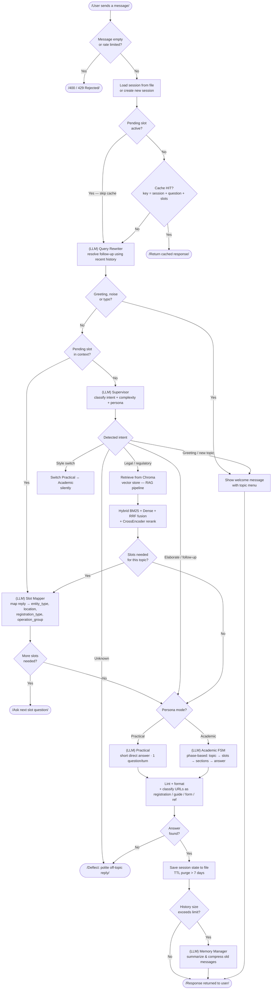

```mermaid
flowchart TD

    I1([/User sends a message/])
    I1 --> A1

    A1{Message empty\nor rate limited?}
    A1 -->|Yes| A2([/400 / 429 Rejected/])
    A1 -->|No| B1

    B1[Load session from file\nor create new session]
    B1 --> B2

    B2{Pending slot\nactive?}
    B2 -->|Yes — skip cache| C1
    B2 -->|No| B3

    B3{Cache HIT?\nkey = session + question + slots}
    B3 -->|Yes| Z1([/Return cached response/])
    B3 -->|No| C1

    C1["(LLM) Query Rewriter\nresolve follow-up using recent history"]
    C1 --> D1

    D1{Greeting, noise\nor typo?}
    D1 -->|Yes| D2[Show welcome message\nwith topic menu]
    D1 -->|No| E1

    E1{Pending slot\nin context?}
    E1 -->|Yes| E2["(LLM) Slot Mapper\nmap reply → entity_type, location,\nregistration_type, operation_group"]
    E2 --> E3{More slots\nneeded?}
    E3 -->|Yes| E4([/Ask next slot question/])
    E3 -->|No| F1
    E1 -->|No| G1

    G1["(LLM) Supervisor\nclassify intent + complexity + persona"]
    G1 --> G2{Detected intent}

    G2 -->|Style switch| G3[Switch Practical ↔ Academic\nsilently]
    G2 -->|Elaborate / follow-up| F1
    G2 -->|Legal / regulatory| H1
    G2 -->|Greeting / new topic| D2
    G2 -->|Unknown| G4([/Deflect: polite off-topic reply/])

    H1[Retrieve from Chroma\nvector store — RAG pipeline]
    H1 --> H2[Hybrid BM25 + Dense + RRF fusion\n+ CrossEncoder rerank]
    H2 --> H3{Slots needed\nfor this topic?}
    H3 -->|Yes| E2
    H3 -->|No| F1

    F1{Persona mode?}
    F1 -->|Practical| F2["(LLM) Practical\nshort direct answer · 1 question/turn"]
    F1 -->|Academic| F3["(LLM) Academic FSM\nphase-based: topic → slots → sections → answer"]

    F2 --> F4
    F3 --> F4

    F4[Lint + format\n+ classify URLs as registration / guide / form / ref]
    F4 --> F5{Answer\nfound?}
    F5 -->|No| G4
    F5 -->|Yes| S1

    S1[Save session state to file\nTTL purge > 7 days]
    S1 --> S2{History size\nexceeds limit?}
    S2 -->|Yes| S3["(LLM) Memory Manager\nsummarize & compress old messages"]
    S2 -->|No| R1
    S3 --> R1

    R1([/Response returned to user/])

    D2 --> R1
```
